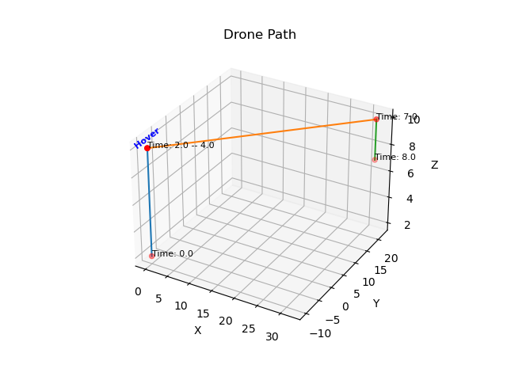

# Drone Generator

This part is a drone signal generator capable of producing signals emitted during the flight of drone. 

## Requirements

- Python 3.x
- NumPy
- SciPy
- Matplotlib
- soundfile
- tqdm (progressbar)
- pyyaml (for reading configuration files)


## Usage 1: Batch Generate Random Drone Flight Data
Run the script drone_generator.py to simulate various drone's flight audio (Default generates 5 samples):
```bash
python drone_generator_main.py 
```
Generate 20 samples:
```bash
python drone_generator_main.py --num 10 --exp exp3 
```


The generated datasets and corresponding flight paths are saved in the **Data/exp3/DroneAudioData** directory. 

You can customize simulation parameters by providing optional command-line arguments.
- `--num`：Number of samples to generate different drone flight situations. Default is `5`.

There are some parameters about synthesis of drone signal which can be modified in **exp_config.yaml**, such as sampling_rate, signaltype, pulse_len, loudness, drone_white_noise. Please copy and put the **exp_config.yaml** in **Data/exp..** folder. These parameters can be freely customized according to your needs — for example, to simulate only "hover" behavior. If you wish to change the parameters again later, simply edit the exp_config.yaml file inside that same folder.

For default, the initial position of each drone flight is randomly generated around (0,0,4). The whole fight is within the following ranges: x [-200, 200], y [-200, 200], z [3, 50]. Each flight consists of many states (default 4), randomly selected from 'forward', 'hover', 'climb', 'sink'.


## Usage 2: Generate Customized Single Drone Flight as Example and Visualization
Furthermore, in addition to batch data generation, there is also an example feature that allows customization of drone types, flight paths, etc. The results of a single flight generated using this customization are saved in the **example** folder.


Run the script drone_generator.py to simulate an example for reference:
```bash
python drone_generator_main.py --exp exp3 --example
```
There are some parameters about synthesis of drone signal and flight which can be customized in **Data/exp../drone_example_config.yaml**, including drone_type, starting_point, flight_state, forward_dir, wind_speed and so on.


**Visualization for example**

The simulation will generate drone positions and visualizations. Related figures will be saved automatically in **Data/exp3/drone_example** folder. For example:
1. Run python drone_generator_main.py --exp exp3 --example



## Reference
[1] Heutschi, K. & Ott, Beat & Nussbaumer, Thomas & Wellig, Peter. (2020). Synthesis of real world drone signals based on lab recordings. Acta Acustica. 4. 10.1051/aacus/2020023.

## 📝 Citation
If you use any files of this repository, please cite:

Yang, X., Naylor, P. A., Doclo, S., Bitzer, J., 
"NEURAL DRONE LOCALIZATION EXPLOITING SIGNAL SYNTHESIS OF REAL-WORLD AUDIO DATA", Eusipco 2025, Italy 


